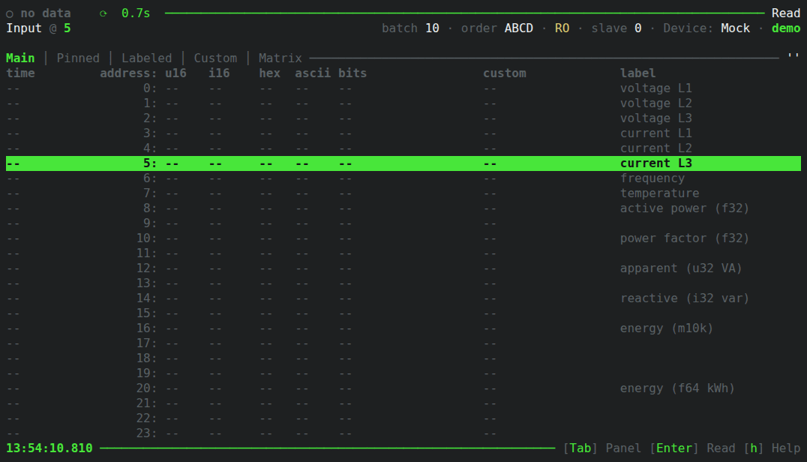

# MTUI - Modbus Terminal User Interface
A very extensive Modbus client available in pretty much any terminal.  
Made in pure safe Rust, based on [tokio-modbus](https://crates.io/crates/tokio-modbus) and [ratatui](https://crates.io/crates/ratatui) (with [ratzilla](https://crates.io/crates/ratzilla) for the web demo).

Play the GIF to see a quick tour, or better yet, try it in your browser (mock device only): **<https://inowattio.github.io/MTUI/>**

## Features
- Modbus TCP and RTU, plus a built-in mock device for playing around
- Live register reading with auto-refresh, pause/resume and slave id selection
- Interpretation columns with configurable word order: u16, i16, hex, binary, ASCII, u32, i32, f32, f64, M10K (and more!)
- Panels: main view, pinned, labeled, custom rules and an address matrix
- Pin, label and custom-rule registers; jump to address or label
- Value graph for a register over time
- Register writes, with a write log and an optional read-only mode
- HTTP API (`POST /read`, `POST /write`)
- Dump read data to a file, copy addresses to the clipboard
- Configurable via `config.json` (or `--config <path>`) and an in-app settings screen

Press `h` inside the app for all available keybinds.

## Run / Build
Grab a binary from [releases](https://github.com/inowattio/modbus-tui/releases) (Windows, Linux x86/Arm, Apple)  
... or just clone the repository and then `cargo run`!
